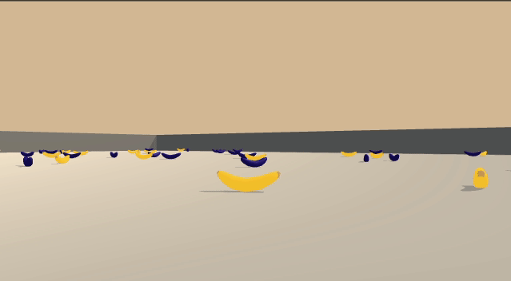

# Deep RL [](https://github.com/psf/black)

[comment]: <> (TODO: Generalize to other environments)



## Game Environment

A reward of +1 is provided for collecting a yellow banana, and a reward of -1 is provided for collecting a blue banana.
Thus, the goal of the agent is to collect as many yellow bananas as possible while avoiding blue bananas.

The state space has 37 dimensions and contains the agent's velocity, along with ray-based perception of objects around
the agent's forward direction. Given this information, the agent has to learn how to best select actions.

Four discrete actions are available, corresponding to:

| Index | Action |
| ---   | ---    |
| 0     | Move forward |
| 1     | Move backward |
| 2     | Turn left     |
| 3     | Turn right    |

The task is episodic, and in order to solve the environment, your agent must get an average score of +13 over 100
consecutive episodes.

## Installation

To easily install the package, clone the repository and use a `virtualenv` to pip install the package in developer mode.

```bash
git clone https://github.com/daniel-m-campos/deep_rl_navigation.git
cd deep_rl_navigation
python -m venv venv # make sure Python 3.6
. venv/bin/activate
pip install -e .
```

### Requirements

See `requirements.txt` and `text-requiremnets.txt`. These are installed during the `pip install` step.

### Binary dependencies

The package depends on the Banana Navigation Unity Environment. Download and save to the appropriate binary from:

* Linux: [click here](https://s3-us-west-1.amazonaws.com/udacity-drlnd/P1/Banana/Banana_Linux.zip)
* Mac OSX: [click here](https://s3-us-west-1.amazonaws.com/udacity-drlnd/P1/Banana/Banana.app.zip)
* Windows (32-bit): [click here](https://s3-us-west-1.amazonaws.com/udacity-drlnd/P1/Banana/Banana_Windows_x86.zip)
* Windows (64-bit): [click here](https://s3-us-west-1.amazonaws.com/udacity-drlnd/P1/Banana/Banana_Windows_x86_64.zip)

And then update the `UNITY_BINARY` path in the `__init__.py` file. The default binary location
is `/usr/local/sbin/Banana.x86_64`.

## Usage

The package provides a [Fire](https://github.com/google/python-fire) CLI for training and playing the agent. To see the
basic commands:

```bash
cd deep_rl_navigation
. venv/bin/activate
python -m deep_rl_navigation --help
```

To see what parameters are available, refer to the `train` and `play` functions in `deep_rl_navigation/__main__.py` as
well as the `__init__` method of `DQNAgent` in `deep_rl_navigation/agent.py`

### Train

To train an agent in the Banana Unity environment with default parameters, run:

```bash
cd deep_rl_navigation
. venv/bin/activate
python -m deep_rl_navigation train
```

To train with custom parameters, run for example:

```bash
python -m deep_rl_navigation train \
  --n_episodes=100 \
  --save_path=None \
  --image_path=None \
  --learning_rate=5e-3
```

### Play

To play an agent in the Banana Unity environment with default parameters, run:

```bash
cd deep_rl_navigation
. venv/bin/activate
python -m deep_rl_navigation play
```

To play with alternative network, run

```bash
python -m deep_rl_navigation play --load_path="path_to_your/network.pth"
```