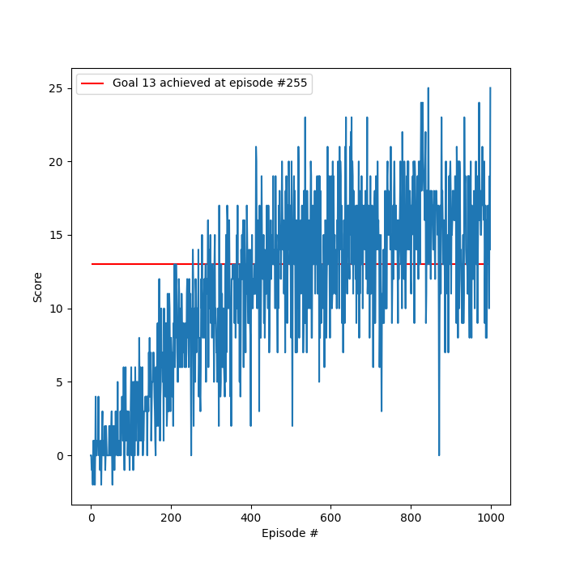

# Report

## Learning Algorithm

The learning algorithm used was Deep Q-Learning with Experience Replay. The algorithm was sourced from the coding
exercise, refactored, and tested. See `model.py`, `agent.py`, `environment.py`, and `train.py` for implementation
details.

### Hyper-parameters

#### Training

| Name | Value | 
| ---            | ---      |
| episodes       | 1000     |
| max time steps | 1000     |
| epsilon start  | 1.0      |
| epsilon end    | 0.01     |
| epsilon decay  | 0.995    |

#### Agent

| Name | Value | 
| ---            | ---      |
| buffer size    | 10,000   | 
| batch size     | 64       | 
| gamma          | 0.99     | 
| tau            | 1e-3     | 
| learning rate  | 5e-4     | 
| update lag     | 4        | 

### Neural Network Architecture

The Neural Network architecture used was:

1. 37 input state vector
2. 64 fully connected ReLU
3. 64 fully connected ReLU
4. 4 out linear action value vector

## Plot of Rewards

## Ideas for Future Work

1. Reduce size of hidden layers. The architecture use was the first attempted but the 64 hidden states for both inner
   layers may be too large causing over-fitting. Smaller hidden layers may improve the plateau performance.
2. Optimize the hyper-parameters. Only the number of episodes was tuned due to sufficient performance early from the
   initial parameters chosen, however better performance could be achieved with further tuning.
3. Attempt or test Double DQN, prioritized Experience Replay, Dueling DQN, or Rainbow. The learning algorithm used was a
   vanilla Deep Q-Learning which happened to achieve sufficient performance but newer methods may be better with a
   smaller hidden layers.