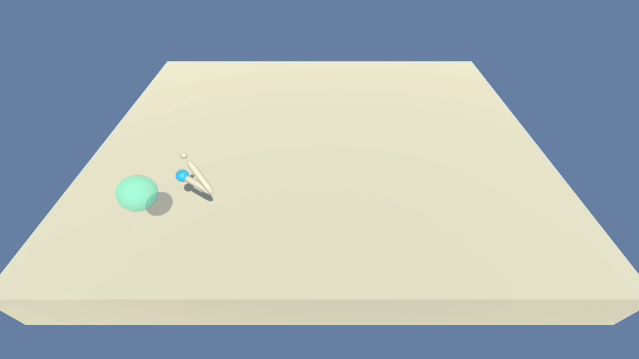

# Continuous Control

## Game Environment

In this environment, a double-jointed arm can move to target locations. A reward of +0.1 is provided for each step that
the agent's hand is in the goal location. Thus, the goal of your agent is to maintain its position at the target
location for as many time steps as possible.

The observation space consists of 33 variables corresponding to position, rotation, velocity, and angular velocities of
the arm. Each action is a vector with four numbers, corresponding to torque applicable to two joints. Every entry in the
action vector should be a number between -1 and 1.

### Option 1: Solve the First Version

The task is episodic, and in order to solve the environment, your agent must get an average score of +30 over 100
consecutive episodes.

### Option 2: Solve the Second Version

The barrier for solving the second version of the environment is slightly different, to take into account the presence
of many agents. In particular, your agents must get an average score of +30 (over 100 consecutive episodes, and over all
agents). Specifically,

After each episode, we add up the rewards that each agent received (without discounting), to get a score for each agent.
This yields 20 (potentially different) scores. We then take the average of these 20 scores. This yields an average score
for each episode (where the average is over all 20 agents).

## Binary dependencies

The package depends on the Banana Navigation Unity Environment. Download and save to the appropriate binary from:

### Version 1: One (1) Agent

* Linux: [click here](https://s3-us-west-1.amazonaws.com/udacity-drlnd/P2/Reacher/one_agent/Reacher_Linux.zip)
* Mac OSX: [click here](https://s3-us-west-1.amazonaws.com/udacity-drlnd/P2/Reacher/one_agent/Reacher.app.zip)
* Windows (32-bit): [click here](https://s3-us-west-1.amazonaws.com/udacity-drlnd/P2/Reacher/one_agent/Reacher_Windows_x86.zip)
* Windows (64-bit): [click here](https://s3-us-west-1.amazonaws.com/udacity-drlnd/P2/Reacher/one_agent/Reacher_Windows_x86_64.zip)

### Version 2: Twenty (20) Agents

* Linux: [click here](https://s3-us-west-1.amazonaws.com/udacity-drlnd/P2/Reacher/Reacher_Linux.zip)
* Mac OSX: [click here](https://s3-us-west-1.amazonaws.com/udacity-drlnd/P2/Reacher/Reacher.app.zip)
* Windows (32-bit): [click here](https://s3-us-west-1.amazonaws.com/udacity-drlnd/P2/Reacher/Reacher_Windows_x86.zip)
* Windows (64-bit): [click here](https://s3-us-west-1.amazonaws.com/udacity-drlnd/P2/Reacher/Reacher_Windows_x86_64.zip)