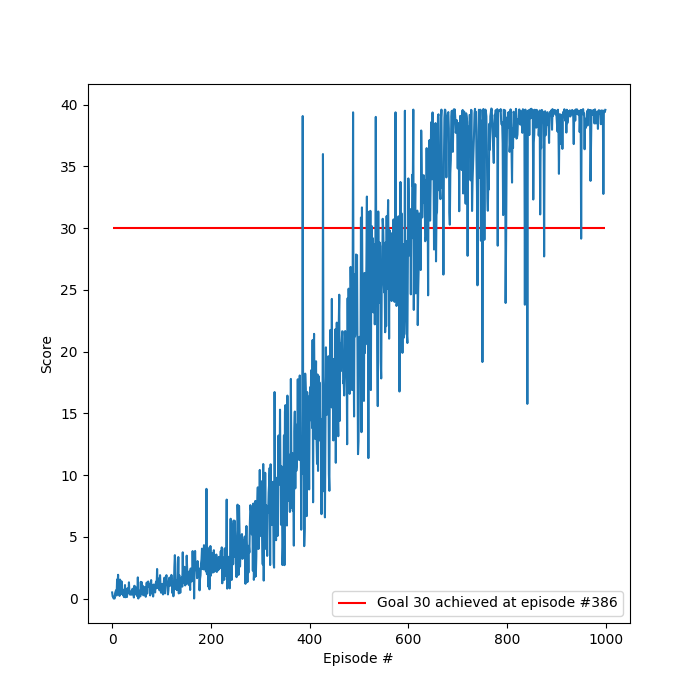

# Report

## Learning Algorithm

The learning algorithm used was Deep Deterministic Policy Gradient (DDPG). The algorithm was sourced from the coding exercise, refactored, and tested. See `model.py`, `agent.py`, `environment.py`, and `train.py` for implementation details.

### Hyper-parameters

#### Training

| Name           | Value    | 
| ---            | ---      |
| episodes       | 1000     |
| max time steps | 1000     |
| epsilon start  | 1.0      |
| epsilon end    | 0.01     |
| epsilon decay  | 0.995    |

#### Agent

| Name                  | Value    | 
| ---                   | ---      |
| buffer size           | 10,000   | 
| batch size            | 128       | 
| gamma                 | 0.99     | 
| tau                   | 1e-3     | 
| actor learning rate   | 2e-4     | 
| critic learning rate  | 2e-4     | 
| update lag            | 20        | 

### Neural Network Architecture

#### Actor

The Actor neural network architecture used was:
1. 33 input state vector
2. 128 fully connected ReLU
3. Batch normalization layer
4. 128 fully connected ReLU
5. 4 output [-1, 1] action vector

#### Critic

The Critic neural network architecture used was:
1. 33 input state vector
2. 128 fully connected ReLU
2. Batch normalization layer
2. 128+4=32 fully connected ReLU
4. 1 linear output action value

## Performance

The agent first achieved a score over 30 at episode 386 and then 100 episode average greater than 30 at episode 600.

### Plot of Rewards

### Table for Average Rewards

| Episode | Average Score |
| :---: | :---:    |
|100  | 0.50   |
|200  | 0.63   |
|300  | 2.39   |
|400  | 7.58   |
|500  | 24.81  |
|600  | 32.61  |
|700  | 36.07  |
|800  | 37.56  |
|900  | 36.47  |
|1000 | 37.89  |

## Ideas for Future Work

1. Attempt the 20 agent environment.
2. Use a grid of hyper-parameters to search over for greater performance.
3. Try other learning algorithms such as REINFORCE, TNPG, RWR, REPS, TRPO, CEM, and CMA-ES.