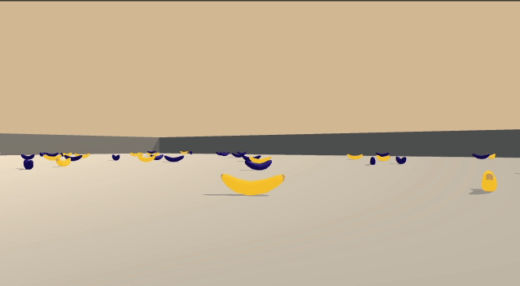

# Navigation

## Game Environment

A reward of +1 is provided for collecting a yellow banana, and a reward of -1 is provided for collecting a blue banana.
Thus, the goal of the agent is to collect as many yellow bananas as possible while avoiding blue bananas.

The state space has 37 dimensions and contains the agent's velocity, along with ray-based perception of objects around
the agent's forward direction. Given this information, the agent has to learn how to best select actions.

Four discrete actions are available, corresponding to:

| Index | Action |
| ---   | ---    |
| 0     | Move forward |
| 1     | Move backward |
| 2     | Turn left     |
| 3     | Turn right    |

The task is episodic, and in order to solve the environment, your agent must get an average score of +13 over 100
consecutive episodes.

## Binary dependencies

The package depends on the Banana Navigation Unity Environment. Download and save to the appropriate binary from:

* Linux: [click here](https://s3-us-west-1.amazonaws.com/udacity-drlnd/P1/Banana/Banana_Linux.zip)
* Mac OSX: [click here](https://s3-us-west-1.amazonaws.com/udacity-drlnd/P1/Banana/Banana.app.zip)
* Windows (32-bit): [click here](https://s3-us-west-1.amazonaws.com/udacity-drlnd/P1/Banana/Banana_Windows_x86.zip)
* Windows (64-bit): [click here](https://s3-us-west-1.amazonaws.com/udacity-drlnd/P1/Banana/Banana_Windows_x86_64.zip)