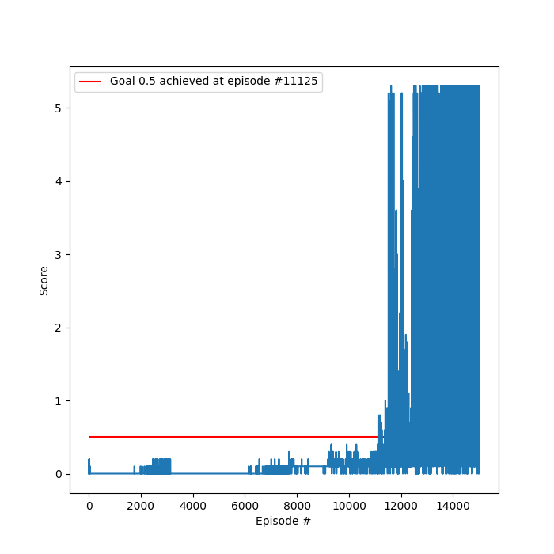

# Report

## Learning Algorithm

The learning algorithm used was Multi-Agent Deep Deterministic Policy Gradient (MADDPG). The algorithm uses are shared
replay buffer and critic networks between agents. An individual DDPG actor network is used per agent.

### Hyper-parameters

#### Training

| Name           | Value    | 
| ---            | ---      |
| episodes       | 15,000   |
| max time steps | 1000     |
| epsilon start  | 1.0      |
| epsilon end    | 0.01     |
| epsilon decay  | 0.995    |

#### Agent

| Name                  | Value | 
| ---                   | ---   |
| buffer size           | 5,000 | 
| batch size            | 256   | 
| gamma                 | 0.99  | 
| tau                   | 1e-3  | 
| actor learning rate   | 2e-4  | 
| critic learning rate  | 2e-4  | 
| update lag            | 20    | 

### Neural Network Architecture

#### Actor

The Actor neural network architecture used was:

1. 24 input state vector
2. 128 fully connected ReLU
3. Batch normalization layer
4. 128 fully connected ReLU
5. 2 output [-1, 1] action vector

#### Critic

The Critic neural network architecture used was:

1. 24 input state vector
2. 128 fully connected ReLU
2. Batch normalization layer
2. 128+2=130 fully connected ReLU
4. 1 linear output action value

## Performance

The agent first achieved a score over 0.5 at episode 11125 and then 100 episode average greater than 0.5 at episode 11700.

### Plot of Rewards

## Ideas for Future Work

1. Further hyper-parameter tuning using grid search.
2. In the `MADDPG` implementation, use shared actor networks rather than individual networks per agent.
3. Use a prioritized replay buffer.